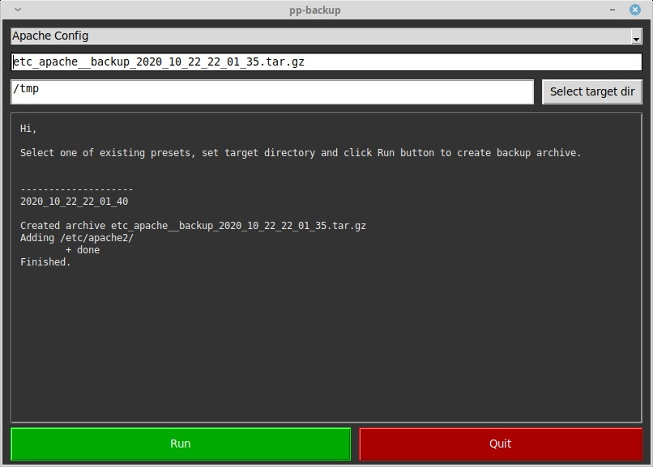

# pp-backup

Application in python3 for doing backups by predefined presets.

# Todo

- Options/arguments for archiver
- Progressbar
- Application should estimate final archive size and check if there's enough space left
- Preset verification before performing backup
- Check if archive already exists
- Handle wildcards in preset sources
